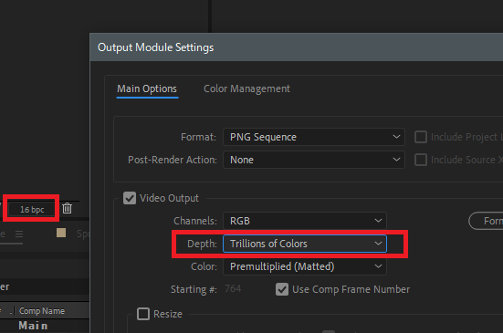
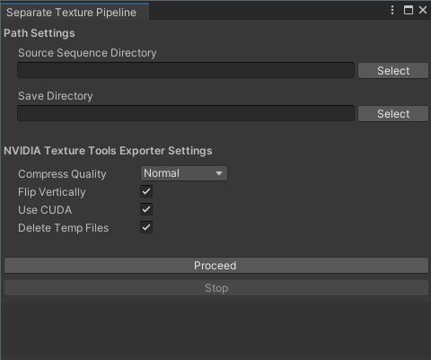

test-spriteUV
==============================
映像ソフトから出力した16bitUV情報の連番画像を8bit2枚に分離し、dds連番を経由して独自フォーマット形式(`.ddsasset`)に変換して再生し、シェーダーからスプライト画像を再マップします。

## dds連番変換手順
AfterEffectsでの出力の際は、プロジェクトパネル設定の色深度を16bit以上にするのと、レンダリングする際の出力フォーマット設定で、以下の設定を行ってください。
- Format : `PNG Sequence  `
- Depth : `Trillions Colors  `  

  

AEで出力した変換前の画像連番は、UnityプロジェクトのAssets内に`Resources`フォルダを作成して配置してください。その際、Import設定で以下の設定を行ってください。
- Advanced>Non-Power of 2 : `None(最終的な画像解像度の情報が必要なので、適宜設定して把握しておいてください) `
- PlatformSetting>Override For PC, Mac & Linux Standalone : `true`
- PlatformSetting>Format : `RGBA 64bit`  

ただしこれをやろうとすると、importの際と、設定変更の際で2度に渡って大量の画像アセットのimport処理が走るので、[impoterの設定自動化のためのクラス](https://github.com/yuta-yt/test-spriteUV/blob/master/Assets/Scripts/Editor/UVTextureImportManager.cs)を使用してimportの時点でまとめて設定するといいです。

連番の変換にはUnity内の`Window>SeparateTexturePipeline`から開けるツールを用いて変換します。

### Path Settings
- Source Sequence Directory : 元の画像連番の入っているフォルダのパスを指定してください。
- Save Directory : 変換したassetを保存するフォルダのパス。実行時点で存在しなくても、サブディレクトリ含めて作成してくれます。再生用のcomponentは一応ビルドのことを考えて`StreamingAssets`内での配置を要求するので、最初からそうしたほうがいいかもしれません。

### NVIDIA Texture Tools Exporter Settings
png->ddsの変換には`NVIDIA Texture Tools Exporter(以下NVTTE)`を使用するので、[公式](https://developer.nvidia.com/nvidia-texture-tools-exporter)から事前にインストーしておいてください。デフォルト以外の位置にインストールした場合は追加でパスを聞かれるので適宜設定してください。
- Compress Quality : ddsの圧縮クオリティ設定。４つありますが、`Production以上に設定するとCPUエンコーダで処理が行われ、処理が非常に遅くなるわりにさして画質上がらないので`、使わないほうがいいです。
- Flip Verticaly : 画像の上下を反転します。NVTTEがOpenGLベースなので、`Unity向けには常にチェックを入れる`のがいいです。
- Use CUDA : チェックを入れるとCUDAで処理を行います。ただし上で触れたように、Compress QualityをProduction以上にすると、この設定が無視されてCPUエンコーダが起動します。
- Delete Temp Files : 変換パイプライン中に作成した中間ファイル群(分離したpng、変換したddsファイル)を終了の際に削除します。  

Requirements
==============================
- Unity 2020.3